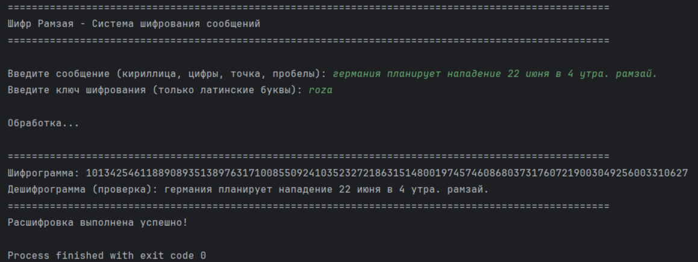

# Ramzay

Реализация исторического шифра Рамзая — одного из самых известных и значимых в истории отечественной криптографии.

## История шифра Рамзая

Одним из самых известных и значимых в истории отечественной криптографии является **Шифр Рамзая** — квадратный (шахматный) шифр, с наложенными на него дополнительными элементами тайнописи. Использовался советскими разведчиками после середины 1930-х годов. Значимым лицом в истории советского шифрования является **Рихард Зорге** (руководитель японской резидентуры ГРУ РККА «Рамзай»).

### Основы шифра «Рамзай»

Советские шифры представляли собой так называемые "ручные шифры", разработка которых значительно опережала общемировой уровень развития криптографии в этой области. Данный вид шифров состоял из так называемого шахматного шифра, наложенного на иные способы тайнописи.

Шифр Рихарда Зорге, руководителя японской резидентуры ГРУ "Рамзай", есть типичный образец действующих шифросистем всех советских спецслужб.

### Принцип работы

1. **Построение шахматной таблицы**: Ключ выписывается в верхней строке квадратной таблицы. В оставшиеся клетки по порядку проставляются буквы алфавита, не вошедшие в ключ. Точка и слеш необходимы для обозначения разделения слов или перехода на цифровой текст.

2. **Использование анаграммы ASINTOER**: В качестве второго шага использовалась анаграмма **ASINTOER** («a sin to err» - грех в заблуждении), в которую входили наиболее часто встречающиеся символы. Буквы из анаграммы нумеровались в таблице по порядку сверху вниз цифрами от 0 до 7. Остальные буквы получали обозначения в виде двузначных чисел от 80 до 99.

3. **Гамма-шифрование**: Первоначальная шифровка текста перекодировалась методом наложения на него бесконечной одноразовой цифровой гаммы по модулю 10. В качестве шифровальных книг для Зорге были выбраны «Статистические ежегодники Германского рейха», издававшиеся в Германии с 1880 по 1943 годы. В данной реализации используется гамма из «Statistisches Jahrbuch für das Deutsche Reich 1935» (Немецкий статистический ежегодник за 1935 год).

## Описание реализации

Данная реализация выполняет шифрование сообщений на кириллице с использованием:
- Транслитерации кириллицы в латиницу
- Матричного шифрования на основе ключа
- Цифрового кодирования символов с использованием анаграммы ASINTOER
- Гамма-шифрования (используется гамма из справочника 1935 года)

## Требования

- Python 3.6+

## Установка

1. Клонируйте репозиторий:
```bash
git clone https://github.com/codemed7-git/CodeRamzay.git
```

2. Перейдите в каталог проекта:
```bash
cd CodeRamzay
```

## Использование

Запустите основной скрипт:
```bash
python main.py
```

Программа запросит:
1. Сообщение для шифрования (принимается только кириллица, цифры и точка)
2. Ключ шифрования

После ввода данных программа выведет:
- Шифрограмму (зашифрованное сообщение)
- Дешифрограмму (расшифрованное сообщение для проверки)

## Пример работы



## Структура проекта

- `main.py` - основной файл для запуска программы
- `encryption.py` - модуль шифрования сообщений
- `de_encryption.py` - модуль расшифровки сообщений
- `transliteration.py` - модуль транслитерации кириллицы в латиницу и обратно
- `utils.py` - утилиты для шифра Рамзая (общие функции для шифрования и расшифровки)